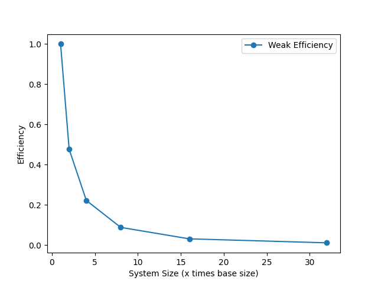
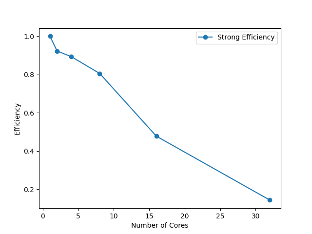
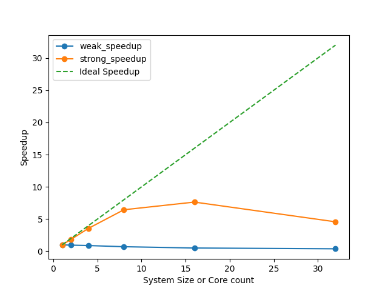
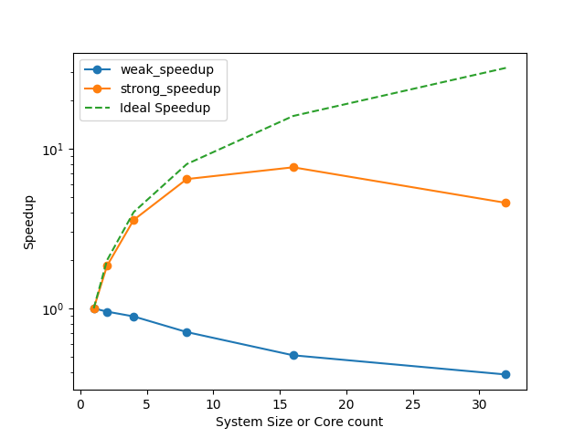
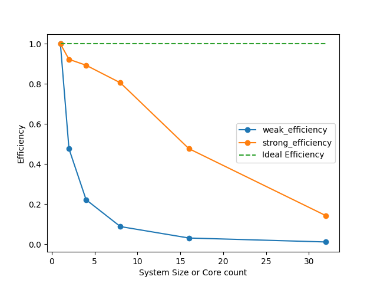

<style media="screen,print"> .pb_after { page-break-after: always !important; } </style>

Complex systems / Molecular Dynamics

Federico Williamson / 13938

## Section I

### Part 1: Run results:

<div class="pb_after"></div>


#### a - Base run
##### Code params
```
run_steps: 1000
```
##### Simulation params
```
use_mpi: False
```
##### Result
TPAS ~= **0.309** microseconds/atom/step/core

|    | Section    |   min time     |     avg time   |   max time     | %varavg   |    %total |
|---:|:-----------|:---------------|---------------:|:---------------|:----------|----------:|
|  0 | Pair       | 8.3566         |     8.3566     | 8.3566         | 0.0       |     84.39 |
|  1 | Neigh      | 1.1928         |     1.1928     | 1.1928         | 0.0       |     12.05 |
|  2 | Comm       | 0.10757        |     0.10757    | 0.10757        | 0.0       |      1.09 |
|  3 | Output     | 0.00010843     |     0.00010843 | 0.00010843     | 0.0       |      0    |
|  4 | Modify     | 0.16354        |     0.16354    | 0.16354        | 0.0       |      1.65 |
|  5 | Other      |                |     0.08229    |                |           |      0.83 |

Loop time: 9.90291

{ width=100% }

<div class="pb_after"></div>

#### b - 10x steps
##### Code params
```
run_steps: 10000
```
##### Simulation params
```
use_mpi: False
```
##### Result
TPAS ~= **0.334** microseconds/atom/step/core

|    | Section    |   min time     |     avg time   |   max time     | %varavg   |    %total |
|---:|:-----------|:---------------|---------------:|:---------------|:----------|----------:|
|  0 | Pair       | 90.965         |      90.965    | 90.965         | 0.0       |     85.06 |
|  1 | Neigh      | 13.062         |      13.062    | 13.062         | 0.0       |     12.21 |
|  2 | Comm       | 0.78149        |       0.78149  | 0.78149        | 0.0       |      0.73 |
|  3 | Output     | 0.012332       |       0.012332 | 0.012332       | 0.0       |      0.01 |
|  4 | Modify     | 1.3527         |       1.3527   | 1.3527         | 0.0       |      1.26 |
|  5 | Other      |                |       0.7685   |                |           |      0.72 |

Loop time: 106.942

{ width=100% }

<div class="pb_after"></div>

#### c - 8x Box
##### Code params
```
run_steps: 1000
box: (40, 40, 40)
```
##### Simulation params
```
use_mpi: False
```
##### Result
TPAS ~= **0.291** microseconds/atom/step/core

|    | Section    |   min time     |     avg time   |   max time     | %varavg   |    %total |
|---:|:-----------|:---------------|---------------:|:---------------|:----------|----------:|
|  0 | Pair       | 62.642         |    62.642      | 62.642         | 0.0       |     84.21 |
|  1 | Neigh      | 8.7813         |     8.7813     | 8.7813         | 0.0       |     11.8  |
|  2 | Comm       | 0.70702        |     0.70702    | 0.70702        | 0.0       |      0.95 |
|  3 | Output     | 0.00070926     |     0.00070926 | 0.00070926     | 0.0       |      0    |
|  4 | Modify     | 1.741          |     1.741      | 1.741          | 0.0       |      2.34 |
|  5 | Other      |                |     0.5186     |                |           |      0.7  |

Loop time: 74.3908

{ width=100% }

<div class="pb_after"></div>

#### c - 8x Box (Elongated)
##### Code params
```
run_steps: 1000
box: (20, 20, 160)
```
##### Simulation params
```
use_mpi: False
```
##### Result
TPAS ~= **0.326** microseconds/atom/step/core

|    | Section    |   min time     |     avg time   |   max time     | %varavg   |    %total |
|---:|:-----------|:---------------|---------------:|:---------------|:----------|----------:|
|  0 | Pair       | 69.91          |    69.91       | 69.91          | 0.0       |     83.81 |
|  1 | Neigh      | 9.174          |     9.174      | 9.174          | 0.0       |     11    |
|  2 | Comm       | 1.5411         |     1.5411     | 1.5411         | 0.0       |      1.85 |
|  3 | Output     | 0.00075547     |     0.00075547 | 0.00075547     | 0.0       |      0    |
|  4 | Modify     | 2.2113         |     2.2113     | 2.2113         | 0.0       |      2.65 |
|  5 | Other      |                |     0.5736     |                |           |      0.69 |

Loop time: 83.4111

{ width=100% }

<div class="pb_after"></div>

#### d - 2x Neigh skin
##### Code params
```
run_steps: 1000
neigh_skin: 0.6
```
##### Simulation params
```
use_mpi: False
```
##### Result
TPAS ~= **0.380** microseconds/atom/step/core

|    | Section    |   min time     |     avg time   |   max time     | %varavg   |    %total |
|---:|:-----------|:---------------|---------------:|:---------------|:----------|----------:|
|  0 | Pair       | 10.491         |    10.491      | 10.491         | 0.0       |     86.38 |
|  1 | Neigh      | 1.3163         |     1.3163     | 1.3163         | 0.0       |     10.84 |
|  2 | Comm       | 0.10174        |     0.10174    | 0.10174        | 0.0       |      0.84 |
|  3 | Output     | 0.00011935     |     0.00011935 | 0.00011935     | 0.0       |      0    |
|  4 | Modify     | 0.15562        |     0.15562    | 0.15562        | 0.0       |      1.28 |
|  5 | Other      |                |     0.07994    |                |           |      0.66 |

Loop time: 12.1447

{ width=100% }

<div class="pb_after"></div>

#### f - With dumps
##### Code params
```
run_steps: 1000
do_image_dump: True
do_video_dump: True
```
##### Simulation params
```
use_mpi: False
```
##### Result
TPAS ~= **0.415** microseconds/atom/step/core

|    | Section    |   min time     |     avg time   |   max time     | %varavg   |    %total |
|---:|:-----------|:---------------|---------------:|:---------------|:----------|----------:|
|  0 | Pair       | 8.2022         |       8.2022   | 8.2022         | 0.0       |     61.82 |
|  1 | Neigh      | 1.177          |       1.177    | 1.177          | 0.0       |      8.87 |
|  2 | Comm       | 0.087281       |       0.087281 | 0.087281       | 0.0       |      0.66 |
|  3 | Output     | 3.5737         |       3.5737   | 3.5737         | 0.0       |     26.93 |
|  4 | Modify     | 0.14929        |       0.14929  | 0.14929        | 0.0       |      1.13 |
|  5 | Other      |                |       0.07885  |                |           |      0.59 |

Loop time: 13.2683

{ width=100% }

<div class="pb_after"></div>

#### g - balanced
##### Code params
```
run_steps: 1000
balance: 1.2 shift xz 5 1.1
```
##### Simulation params
```
use_mpi: False
```
##### Result
TPAS ~= **0.306** microseconds/atom/step/core

|    | Section    |   min time     |     avg time   |   max time     | %varavg   |    %total |
|---:|:-----------|:---------------|---------------:|:---------------|:----------|----------:|
|  0 | Pair       | 8.2646         |     8.2646     | 8.2646         | 0.0       |     84.52 |
|  1 | Neigh      | 1.1812         |     1.1812     | 1.1812         | 0.0       |     12.08 |
|  2 | Comm       | 0.099558       |     0.099558   | 0.099558       | 0.0       |      1.02 |
|  3 | Output     | 0.00011045     |     0.00011045 | 0.00011045     | 0.0       |      0    |
|  4 | Modify     | 0.15309        |     0.15309    | 0.15309        | 0.0       |      1.57 |
|  5 | Other      |                |     0.07935    |                |           |      0.81 |

Loop time: 9.77792

{ width=100% }

<div class="pb_after"></div>

#### e - Overall system energy

|      |    TotEng a |    TotEng b |   TotEng c |   TotEng c2 |    TotEng d |    TotEng f |    TotEng g |
|:-----|------------:|------------:|-----------:|------------:|------------:|------------:|------------:|
| mean | -5.27463    | -5.27853    |  -5.27459  | -5.2746     | -5.27463    | -5.27463    | -5.27463    |
| std  |  0.00172513 |  0.00443424 |   0.001724 |  0.00173248 |  0.00172513 |  0.00172513 |  0.00172513 |

<div class="pb_after"></div>


{ width=100% }
{ width=45% }
{ width=45% }
{ width=45% }
{ width=45% }
{ width=45% } { width=45% }
{ width=45% }


a: Base run

b: The simulation cost increases by about 10x, because the number of steps increases by 10x, and we are running on the same number of cores.

c: The simulation cost increases by about 8x, because the box size increases by 8x, and we are running on the same number of cores.

c2: The simulation cost increases by about 8x, because the box size increases by 8x, and we are running on the same number of cores. (There seems to be no performance overhead when running on a single machine)

d: The increase appears to be quadratic. As shown in the following graph { width=100% }

e: They are very similar, this is to be expected as the number of steps is the same, and the number of atoms is the same.

f: The simulation cost increases slightly (~3s), this might be influenced by the fact that my SSD is very fast.

g: The simulation cost decreases by about 10%, this is to be expected as the load is balanced between the cores.


### Part 2

#### a: Strong scaling

strong 2x: The simulation cost decreases by about 2x, this is to be expected as the number of atoms is the same, but the number of cores is 2x.

strong 4x: The simulation cost decreases by about 4x, this is to be expected as the number of atoms is the same, but the number of cores is 4x.

strong 8x: The simulation cost decreases by slightly less than 8x

strong 16x: The simulation cost decreases by slightly less than 16x

strong 32x - hw: The simulation cost increases by about 3x with respect to 2. strong 16x, this is to be expected as the number of steps is the same, but the number of cores is 32x, and my machine only has 16 physical cores.


### b: Weak scaling

> All the weak scaling tests are run on 16 cores

weak 2x: The simulation cost increases by about 2x, this is to be expected as the number of atoms is the 2x, but the number of cores is the same.

weak 4x: The simulation cost increases by about 4x, this is to be expected as the number of atoms is the 4x, but the number of cores is the same.

weak 8x: The simulation cost increases by about 8x, this is to be expected as the number of atoms is the 8x, but the number of cores is the same.

weak 16x: The simulation cost increases by about 16x, this is to be expected as the number of atoms is the 16x, but the number of cores is the same.

weak 32x: The simulation cost increases by about 32x, this is to be expected as the number of atoms is the 32x, but the number of cores is the same.


### b-2: Memory constraints

#### GPU

Max atom count simulatable on my *gpu* [180 * 100 * 100] * 4 = 7.2M (No swapping)

Higher values yield `ERROR on proc 0: Insufficient memory on accelerator (src/GPU/pair_lj_cut_gpu.cpp:110)`

It refused to do 200 * 200 * 100 * 4 = 16M

#### CPU

Max atom count simulatable on my *cpu* [300 * 200 * 200] * 4 = 48_000_000 = 48M (1 timestep ~= 37s)

Above this, eg [300, 210, 200] lammps starts computing (Prints the initial TotEng, Pressure, E_pair, etcc) but fails with NZEC and no error in any log, but the memory usage does not reach 100%, so this doesn't seem to be the issue either.

## Section II: Ovito
 
### a: Solid or Liquid?

To check if the sample has a solid or liquid structure, we can check the coordination's radial distribution of the atoms. If the sample is solid, then the distribution function will appear near discrete.

Results: At the start of the simulation, the sample is solid, as the distribution function has very pronounced spikes due to the shape of FCC.

At the end of the simulation, the sample is liquid, as the distribution function is much smoother, however it still retains some of the spikes.

If this were not the case, then the sample would be considered a gas.

{ width=100% }

{ width=100% }

### b

We have FCC, if we tell ovito to ignore PBC, then the atoms at the boundry would not be detected as fcc conformant,

To calculate this we note the following:
- The coordination of FCC is 12.
- The coordination of the atoms at the corners is 3, as there are first neighbors in only one direction for each dimension.
- The coordination of the atoms on the edges is 5, as there are first neighbors in two directions for each dimension.
- The coordination of the atoms on the faces is 8, as there are first neighbors in three directions for each dimension.
- The coordination of the atoms in the middle is 12, as there are first neighbors in all directions for each dimension.

Or so it should be, however, the coordination of the atoms in each of the corners is not always 3.

This can be explained because the corners are not always the corner of an FCC cell, but sometimes the face centre.

As a matter of fact, varying the voronoi polyhedra analysis' relative face area threshold between 0 and 20%, we can see that the coordination of some corners goes from 5 to 0. But never matches all the other corners simultaneously.

As this makes the calculation very complex, and not only does this cause issues with corners, it also causes issues with edges.

This phenomena can be observed in the following figures

{ width=100% }

{ width=100% }

Here we can see that the atoms at the edges and corners are not detected as FCC conformant.

The inner attoms have been removed for clarity.


{ width=100% }

We can also see the coordination histogram, which, other than 12, shows a lot of 9. Which is unexpected.

Zooming into the histogram past that, we can see some 5, 6, 7 and 8. Further confirming that the edges and corners are not detected as FCC conformant, however also not aligning with our initial suposition that of 3, 5, 8, 12.

{ width=100% }

### c

{ width=100% }

{ width=100% }

{ width=100% }

### d

I. 

{ width=100% }

II. Drastic changes to the mean value usually indicate a phase change, this is not the case here.

III. The displacements along xyz are very similar, this is to be expected as we have PBC and the sample is homogeneous.

## Section III

Definitely!

