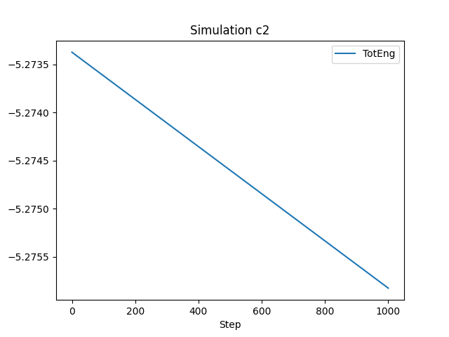

# TP 1

Complex systems / Molecular Dynamics

Federico Williamson / 13938

## a - Base run

### Code params

```
run_steps: 1000
```

### Simulation params

```
use_gpu: False
use_mpi: False
in_toko: False
```

### Result

TPAS ~= **0.420703125** microseconds/atom/step/core

|   | Section | min time | avg time | max time | %varavg | %total |
|--:|:--------|:---------|---------:|:---------|:--------|-------:|
| 0 | Pair    | 10.959   |   10.959 | 10.959   | 0.0     |   81.4 |
| 1 | Neigh   | 2.2116   |   2.2116 | 2.2116   | 0.0     |  16.43 |
| 2 | Comm    | 0.062392 | 0.062392 | 0.062392 | 0.0     |   0.46 |
| 3 | Output  | 0.015048 | 0.015048 | 0.015048 | 0.0     |   0.11 |
| 4 | Modify  | 0.19276  |  0.19276 | 0.19276  | 0.0     |   1.43 |
| 5 | Other   |          |   0.0221 |          |         |   0.16 |

Loop time: 13.4625


## b - 10x steps

### Code params

```
run_steps: 10000
```

### Simulation params

```
use_gpu: False
use_mpi: False
in_toko: False
```

### Result

TPAS ~= **0.412709375** microseconds/atom/step/core

|   | Section | min time | avg time | max time | %varavg | %total |
|--:|:--------|:---------|---------:|:---------|:--------|-------:|
| 0 | Pair    | 107.36   |   107.36 | 107.36   | 0.0     |   81.3 |
| 1 | Neigh   | 22.35    |    22.35 | 22.35    | 0.0     |  16.92 |
| 2 | Comm    | 0.49292  |  0.49292 | 0.49292  | 0.0     |   0.37 |
| 3 | Output  | 0.15408  |  0.15408 | 0.15408  | 0.0     |   0.12 |
| 4 | Modify  | 1.5266   |   1.5266 | 1.5266   | 0.0     |   1.16 |
| 5 | Other   |          |   0.1798 |          |         |   0.14 |

Loop time: 132.067


## c - 8x Box

### Code params

```
run_steps: 1000
box: (40, 40, 40)
```

### Simulation params

```
use_gpu: False
use_mpi: False
in_toko: False
```

### Result

TPAS ~= **0.3998671875** microseconds/atom/step/core

|   | Section | min time | avg time | max time | %varavg | %total |
|--:|:--------|:---------|---------:|:---------|:--------|-------:|
| 0 | Pair    | 82.487   |   82.487 | 82.487   | 0.0     |  80.58 |
| 1 | Neigh   | 16.993   |   16.993 | 16.993   | 0.0     |   16.6 |
| 2 | Comm    | 0.38905  |  0.38905 | 0.38905  | 0.0     |   0.38 |
| 3 | Output  | 0.12011  |  0.12011 | 0.12011  | 0.0     |   0.12 |
| 4 | Modify  | 1.9559   |   1.9559 | 1.9559   | 0.0     |   1.91 |
| 5 | Other   |          |   0.4204 |          |         |   0.41 |

Loop time: 102.366


## c - 8x Box (Elongated)

### Code params

```
run_steps: 1000
box: (20, 20, 160)
```

### Simulation params

```
use_gpu: False
use_mpi: False
in_toko: False
```

### Result

TPAS ~= **0.4077421875** microseconds/atom/step/core

|   | Section | min time | avg time | max time | %varavg | %total |
|--:|:--------|:---------|---------:|:---------|:--------|-------:|
| 0 | Pair    | 84.136   |   84.136 | 84.136   | 0.0     |   80.6 |
| 1 | Neigh   | 16.952   |   16.952 | 16.952   | 0.0     |  16.24 |
| 2 | Comm    | 0.65029  |  0.65029 | 0.65029  | 0.0     |   0.62 |
| 3 | Output  | 0.11537  |  0.11537 | 0.11537  | 0.0     |   0.11 |
| 4 | Modify  | 2.1065   |   2.1065 | 2.1065   | 0.0     |   2.02 |
| 5 | Other   |          |   0.4212 |          |         |    0.4 |

Loop time: 104.382



## d - 2x Neigh skin

### Code params

```
run_steps: 1000
neigh_skin: 0.6
```

### Simulation params

```
use_gpu: False
use_mpi: False
in_toko: False
```

### Result

TPAS ~= **0.5683625** microseconds/atom/step/core

|   | Section | min time | avg time | max time | %varavg | %total |
|--:|:--------|:---------|---------:|:---------|:--------|-------:|
| 0 | Pair    | 15.47    |    15.47 | 15.47    | 0.0     |  85.06 |
| 1 | Neigh   | 2.4615   |   2.4615 | 2.4615   | 0.0     |  13.53 |
| 2 | Comm    | 0.054276 | 0.054276 | 0.054276 | 0.0     |    0.3 |
| 3 | Output  | 0.016529 | 0.016529 | 0.016529 | 0.0     |   0.09 |
| 4 | Modify  | 0.1653   |   0.1653 | 0.1653   | 0.0     |   0.91 |
| 5 | Other   |          |  0.01957 |          |         |   0.11 |

Loop time: 18.1876


## f - With dumps

### Code params

```
run_steps: 1000
do_image_dump: True
do_video_dump: True
```

### Simulation params

```
use_gpu: False
use_mpi: False
in_toko: False
```

### Result

TPAS ~= **0.5158125** microseconds/atom/step/core

|   | Section | min time | avg time | max time | %varavg | %total |
|--:|:--------|:---------|---------:|:---------|:--------|-------:|
| 0 | Pair    | 10.499   |   10.499 | 10.499   | 0.0     |  63.61 |
| 1 | Neigh   | 2.1698   |   2.1698 | 2.1698   | 0.0     |  13.15 |
| 2 | Comm    | 0.048916 | 0.048916 | 0.048916 | 0.0     |    0.3 |
| 3 | Output  | 3.6045   |   3.6045 | 3.6045   | 0.0     |  21.84 |
| 4 | Modify  | 0.16623  |  0.16623 | 0.16623  | 0.0     |   1.01 |
| 5 | Other   |          |  0.01791 |          |         |   0.11 |

Loop time: 16.506


## g - balanced

### Code params

```
run_steps: 1000
balance: 1.2 shift xz 5 1.1
```

### Simulation params

```
use_gpu: False
use_mpi: False
in_toko: False
```

### Result

TPAS ~= **0.40725** microseconds/atom/step/core

|   | Section | min time | avg time | max time | %varavg | %total |
|--:|:--------|:---------|---------:|:---------|:--------|-------:|
| 0 | Pair    | 10.592   |   10.592 | 10.592   | 0.0     |  81.28 |
| 1 | Neigh   | 2.1932   |   2.1932 | 2.1932   | 0.0     |  16.83 |
| 2 | Comm    | 0.052155 | 0.052155 | 0.052155 | 0.0     |    0.4 |
| 3 | Output  | 0.014953 | 0.014953 | 0.014953 | 0.0     |   0.11 |
| 4 | Modify  | 0.1602   |   0.1602 | 0.1602   | 0.0     |   1.23 |
| 5 | Other   |          |  0.01904 |          |         |   0.15 |

Loop time: 13.032


## e - Overall system energy

|      |   TotEng a |    TotEng b |   TotEng c |  TotEng c2 |   TotEng d |   TotEng f |   TotEng g |
|:-----|-----------:|------------:|-----------:|-----------:|-----------:|-----------:|-----------:|
| mean |   -5.27975 |    -5.28053 |   -5.27986 |   -5.27978 |   -5.27975 |   -5.27975 |   -5.27975 |
| std  | 0.00286998 | 0.000956819 | 0.00293146 | 0.00288412 | 0.00286998 | 0.00286998 | 0.00286998 |

Run results:

a: Base run

b: The simulation cost increases by about 10x, because the number of steps increases by 10x, and we are running on the same number of cores.

c: The simulation cost increases by about 8x, because the box size increases by 8x, and we are running on the same number of cores.

c2: The simulation cost increases by about 8x, because the box size increases by 8x, and we are running on the same number of cores. (There seems to be no performance overhead when running on a single machine)

d: I would expect the simulation cost to increase by about 2x, because the number of steps is the same, but the number of neighbors to check is 2x.

e: They are very similar, this is to be expected as the number of steps is the same, and the number of atoms is the same.

f: The simulation cost increases slightly (~3s), this might be influenced by the fact that my SSD is very fast.

g: The simulation cost decreases by about 10%, this is to be expected as the load is balanced between the cores.
strong 2x: The simulation cost decreases by about 2x, this is to be expected as the number of atoms is the same, but the number of cores is 2x.

strong 4x: The simulation cost decreases by about 4x, this is to be expected as the number of atoms is the same, but the number of cores is 4x.

strong 8x: The simulation cost decreases by slightly less than 8x

strong 16x: The simulation cost decreases by slightly less than 16x

strong 32x - hw: The simulation cost increases by about 3x with respect to 2. strong 16x, this is to be expected as the number of steps is the same, but the number of cores is 32x, and my machine only has 16 physical cores.

> All the weak scaling tests are run on 16 cores, as my machine only has 16 physical cores.


weak 2x: The simulation cost increases by about 2x, this is to be expected as the number of atoms is the 2x, but the number of cores is the same.

weak 4x: The simulation cost increases by about 4x, this is to be expected as the number of atoms is the 4x, but the number of cores is the same.

weak 8x: The simulation cost increases by about 8x, this is to be expected as the number of atoms is the 8x, but the number of cores is the same.

weak 16x: The simulation cost increases by about 16x, this is to be expected as the number of atoms is the 16x, but the number of cores is the same.

weak 32x: The simulation cost increases by about 32x, this is to be expected as the number of atoms is the 32x, but the number of cores is the same.

Max atom count simulatable on my pc 200 * 100 * 100 * 4 = 8M

It refused to do 200 * 200 * 100 * 4 = 16M

3.a) To check if the sample has a solid or liquid structure, we can check the coordination number of the atoms. If the coordination number is mostly 12, then the sample is solid, otherwise, then the sample is liquid.

Results: Coordination at the start is 12, but at the end it is much more spread out arrout 14

3.b) We have FCC, if we tell ovito to ignore PBC, then the attoms at the boundry would not be detected as fcc conformant,

An expectable proportion would be arrount 1/6, but for some reason its closer to 1/7 in practice.


3.c)

(View figures appendix)


3.d)


II. Drastic changes to the mean value usually indicate a phase change, this is not the case here.

III. The displacements along xyz are very similar, this is to be expected as we have PBC and the sample is homogeneous.

## Figures Appendix:
